# Ophel 🚀

> Transforma chats de IA en documentos legibles, navegables y reutilizables

<div align="center">
  

  <h3 style="margin-top: -2px;">✨ Convierte las conversaciones en conocimiento, no solo en historia ✨</h3>
  
  <p>
    No más perderse en el desplazamiento infinito. Aclara el contexto con esquemas en tiempo real, construye tu sistema con carpetas de conversación, refina la experiencia con la biblioteca de prompts y deja que los pensamientos brillantes fluyan libremente en orden.
  </p>
  
  <p align="center" style="font-size: 12px; color: #555;">👇 Demo: De "Historial de chat infinito" a "Documentos de IA navegables"</p>
  
  
  <p>
    <strong><em>Haciendo del chat con IA un flujo de trabajo verdaderamente organizable por primera vez</em></strong><br/>
  </p>

  <small style="opacity: 0.6;">
  No importa qué plataforma uses, Ophel te permite organizar conversaciones en flujos de trabajo reutilizables con una experiencia consistente y unificada.
  </small>
  <p>
    <a href="https://chatgpt.com"></a>
    <a href="https://gemini.google.com"></a>
    <a href="https://grok.com"></a>
    <a href="https://claude.ai"></a>
    <a href="https://aistudio.google.com"></a>
    <a href="https://business.gemini.google/"></a>
    <a href="https://github.com/urzeye/ophel/issues"></a>
    </br>
    
    <a href="../../LICENSE"></a>
    
    <a href="https://github.com/urzeye/ophel/stargazers"></a>
    <a href="https://github.com/urzeye/ophel/network/members"></a>
    </br>
    <a href="https://chromewebstore.google.com/detail/ophel-ai-%E5%AF%B9%E8%AF%9D%E5%A2%9E%E5%BC%BA%E5%B7%A5%E5%85%B7/lpcohdfbomkgepfladogodgeoppclakd"></a>
    <a href="https://addons.mozilla.org/zh-CN/firefox/addon/ophel-ai-chat-enhancer/"></a>
    <a href="https://greasyfork.org/zh-CN/scripts/563646-ophel-ai-chat-page-enhancer"></a>
  </p>

</div>

<!-- Promo Link -->
<p align="center">
  📣 <a href="https://github.com/urzeye/ophel/issues/30">
    <strong>Help promote Ophel</strong>
  </a>
  <br/>
  <a href="https://www.producthunt.com/products/ophel?embed=true&utm_source=badge-featured&utm_medium=badge&utm_campaign=badge-ophel" target="_blank" rel="noopener noreferrer"></a>
</p>

<p align="center">
  <a href="#-demo">Demo</a> •
  <a href="#-características-principales">Características Principales</a> •
  <a href="#-inicio-rápido">Inicio Rápido</a> •
  <a href="#%EF%B8%8F-arquitectura">Arquitectura</a> •
  <a href="#-soporte">Soporte</a>
</p>

<p align="center">
  🌐 <a href="../../README_EN.md">English</a> | <a href="../../README.md">简体中文</a> | <a href="./README_zh-TW.md">繁體中文</a> | <a href="./README_ja.md">日本語</a> | <a href="./README_ko.md">한국어</a> | <a href="./README_de.md">Deutsch</a> | <a href="./README_fr.md">Français</a> | <strong>Español</strong> | <a href="./README_pt.md">Português</a> | <a href="./README_ru.md">Русский</a>
</p>

## 📹 Demo

|                                                          Outline                                                           |                                                       Conversations                                                        |                                                          Features                                                          |
| :------------------------------------------------------------------------------------------------------------------------: | :------------------------------------------------------------------------------------------------------------------------: | :------------------------------------------------------------------------------------------------------------------------: |
| <video src="https://github.com/user-attachments/assets/a40eb655-295e-4f9c-b432-9313c9242c9d" width="280" controls></video> | <video src="https://github.com/user-attachments/assets/a249baeb-2e82-4677-847c-2ff584c3f56b" width="280" controls></video> | <video src="https://github.com/user-attachments/assets/6dfca20d-2f88-4844-b3bb-c48321100ff4" width="280" controls></video> |

## ✨ Características Principales

- 🧠 **Smart Outline** — Analiza automáticamente consultas y respuestas de IA en una estructura navegable
- 💬 **Conversation Manager** — Carpetas, etiquetas, búsqueda, operaciones por lotes
- ⌨️ **Prompt Library** — Variables, vista previa Markdown, categorías, inserción con un clic
- 🎨 **Personalización de Temas** — 20+ temas oscuros/claros, CSS personalizado
- 🔧 **Optimización UI** — Modo pantalla ancha, control de ancho, diseño de barra lateral
- 📖 **Experiencia de Lectura** — Bloqueo de desplazamiento, restauración de posición, renderizado Markdown
- ⚡ **Productividad** — Atajos, bloqueo de modelo, renombrado automático, notificaciones
- 🎭 **Mejora de Claude** — Gestión de Key de sesión, cambio multi-cuenta
- 🔒 **Privacidad Primero** — Almacenamiento local, sinc WebDAV, sin recolección de datos

## 🚀 Inicio Rápido

> [!tip]
>
> **Recomendamos encarecidamente usar la versión de Extensión del Navegador** para un conjunto de características más completo, mejor experiencia y mayor compatibilidad. La versión Userscript tiene limitaciones.

### Web Store

<a href="https://chromewebstore.google.com/detail/ophel-ai-%E5%AF%B9%E8%AF%9D%E5%A2%9E%E5%BC%BA%E5%B7%A5%E5%85%B7/lpcohdfbomkgepfladogodgeoppclakd"></a>
<a href="https://addons.mozilla.org/zh-CN/firefox/addon/ophel-ai-chat-enhancer/"></a>
<a href="https://greasyfork.org/zh-CN/scripts/563646-ophel-ai-chat-page-enhancer"></a>

### Instalación Manual

#### Extensión del Navegador

1. Descarga y descomprime desde [Releases](https://github.com/urzeye/ophel/releases/latest)
2. Abre la página de administración de extensiones, activa el **Modo desarrollador**
3. Haz clic en **Cargar descomprimida** y selecciona la carpeta descomprimida

#### Userscript

1. Instala [Tampermonkey](https://www.tampermonkey.net/)
2. Descarga el archivo `.user.js` desde [Releases](https://github.com/urzeye/ophel/releases)
3. Arrástralo al navegador o haz clic en el enlace para instalar

### Build Local

<details>
<summary>Haz clic para expandir los pasos de construcción</summary>

**Requisitos**: Node.js >= 20.x, pnpm >= 9.x

```bash
git clone https://github.com/urzeye/ophel.git
cd ophel

pnpm install
pnpm dev              # Modo desarrollo
pnpm build            # Build producción Chrome/Edge
pnpm build:firefox    # Build producción Firefox
pnpm build:userscript # Build producción Userscript
```

</details>

## 🏗️ Arquitectura

**Tech Stack**: [Plasmo](https://docs.plasmo.com/) + [React](https://react.dev/) + [TypeScript](https://www.typescriptlang.org/) + [Zustand](https://github.com/pmndrs/zustand)

```mermaid
%%{init: {'theme': 'base', 'themeVariables': { 'primaryColor': '#6366f1', 'primaryTextColor': '#fff', 'primaryBorderColor': '#4f46e5', 'lineColor': '#94a3b8', 'secondaryColor': '#f1f5f9', 'tertiaryColor': '#e2e8f0', 'background': '#ffffff'}}}%%
flowchart TB
    subgraph Platforms["🚀 Dual Platform Build"]
        direction LR
        EXT["🧩 Browser Extension<br/><small>Plasmo + Manifest V3</small>"]
        US["🛢️ Userscript<br/><small>Vite + vite-plugin-monkey</small>"]
    end

    subgraph Entry["📦 Entry Layer"]
        direction LR
        CE["Content Script<br/><small>ui-entry.tsx</small>"]
        BG["Background<br/><small>background.ts</small>"]
        OPT["Options Page<br/><small>tabs/options.tsx</small>"]
        USE["Userscript Entry<br/><small>platform/userscript/entry.tsx</small>"]
    end

    subgraph Adapters["🔌 Site Adapters"]
        direction LR
        GEM["Gemini"]
        GPT["ChatGPT"]
        CLA["Claude"]
        GRK["Grok"]
        AIS["AI Studio"]
        GEE["Gemini<br/>Enterprise"]
    end

    subgraph Core["⚙️ Core Modules"]
        direction TB
        TM["🎨 Theme Manager<br/><small>Theme Switch · View Transitions</small>"]
        OM["📑 Outline Manager<br/><small>Outline Generation · Navigation</small>"]
        RH["📖 Reading History<br/><small>Position Restore</small>"]
        ML["🔒 Model Lock<br/><small>Model Locking</small>"]
        NM["📡 Network Monitor<br/><small>Request Interception · Status Detection</small>"]
    end

    subgraph State["💾 State Management"]
        direction LR
        ZS["Zustand Stores<br/><small>settings · prompts · conversations</small>"]
        CS["Chrome Storage<br/><small>local · sync</small>"]
        GM["GM_* Storage<br/><small>Userscript API</small>"]
    end

    subgraph UI["🎯 UI Components"]
        direction TB
        APP["App.tsx"]
        MP["MainPanel<br/><small>Side Panel</small>"]
        SM["SettingsModal<br/><small>Settings Dialog</small>"]
        TABS["Tabs<br/><small>Outline · Conversations · Prompts</small>"]
    end

    subgraph CSS["🎨 Styling System"]
        direction LR
        SD["Shadow DOM<br/><small>Style Isolation</small>"]
        TV["CSS Variables<br/><small>Theme Variables</small>"]
        TH["Theme Presets<br/><small>20+ Preset Themes</small>"]
    end

    %% Connections
    EXT --> CE & BG & OPT
    US --> USE

    CE --> Adapters
    USE --> Adapters

    Adapters --> Core
    Core --> State

    CE --> UI
    USE --> UI
    UI --> CSS

    ZS <--> CS
    ZS <-.-> GM

    %% Styles
    classDef platform fill:#818cf8,stroke:#6366f1,color:#fff
    classDef entry fill:#34d399,stroke:#10b981,color:#fff
    classDef adapter fill:#fbbf24,stroke:#f59e0b,color:#1f2937
    classDef core fill:#60a5fa,stroke:#3b82f6,color:#fff
    classDef state fill:#f472b6,stroke:#ec4899,color:#fff
    classDef ui fill:#a78bfa,stroke:#8b5cf6,color:#fff
    classDef css fill:#fb923c,stroke:#f97316,color:#fff

    class EXT,US platform
    class CE,BG,OPT,USE entry
    class GEM,GPT,CLA,GRK,AIS,GEE adapter
    class TM,OM,RH,ML,NM core
    class ZS,CS,GM state
    class APP,MP,SM,TABS ui
    class SD,TV,TH css
```

<details>
<summary>📐 Diagrama de Arquitectura (clic para expandir)</summary>



</details>

### 🐛 Reportar Error

Para problemas o sugerencias, visita [GitHub Issues](https://github.com/urzeye/ophel/issues).

## ⭐ Star History

<a href="https://star-history.com/#urzeye/ophel&Date">
 <picture>
   <source media="(prefers-color-scheme: dark)" srcset="https://api.star-history.com/svg?repos=urzeye/ophel&type=Date&theme=dark" />
   <source media="(prefers-color-scheme: light)" srcset="https://api.star-history.com/svg?repos=urzeye/ophel&type=Date" />
   
 </picture>
</a>

## 💖 Soporte

<p align="center">
  <em>"If you want to go fast, go alone. If you want to go far, go together."</em>
</p>

<p align="center">
  Si Ophel mejora tu flujo de trabajo, considera apoyar vía Star o Sponsor para ayudarnos a ir más lejos.
</p>

<p align="center">
  Made with ❤️ by <a href="https://github.com/urzeye">urzeye</a>
</p>

## 📜 Licencia

Este proyecto está bajo la licencia **CC BY-NC-SA 4.0**. Ver [LICENSE](../../LICENSE) para detalles.

> ⚠️ **El empaquetado comercial, la reventa o la integración no autorizada están prohibidos.** Para licencias comerciales: **<igodu.love@gmail.com>**
