# Ophel 🚀

<p align="center">
  
</p>

<p align="center">
  <strong>✨ Los beneficios de la IA, al alcance de tu mano ✨</strong><br/>
  <em>AI's Benefit, Within Reach.</em>
</p>

<p align="center">
  <a href="../../LICENSE"></a>
  
  <a href="https://github.com/urzeye/ophel/stargazers"></a>
  <a href="https://opencollective.com/urzeye-oss"></a>
</p>

<p align="center">
  <a href="#-demo">Demo</a> •
  <a href="#-características-principales">Características</a> •
  <a href="#%EF%B8%8F-arquitectura-técnica">Arquitectura técnica</a> •
  <a href="#-inicio-rápido">Inicio rápido</a> •
  <a href="#-support">Apoyar el proyecto</a>
</p>

<p align="center">
  🌐 <a href="../../README_EN.md">English</a> | <a href="../../README.md">简体中文</a> | <a href="./README_zh-TW.md">繁體中文</a> | <a href="./README_ja.md">日本語</a> | <a href="./README_ko.md">한국어</a> | <a href="./README_de.md">Deutsch</a> | <a href="./README_fr.md">Français</a> | <strong>Español</strong> | <a href="./README_pt.md">Português</a> | <a href="./README_ru.md">Русский</a>
</p>

---

👋 **Ophel** es una herramienta de mejora de páginas de chat de IA que admite tanto **extensiones de navegador** como **userscripts**, proporcionando una experiencia interactiva unificada para las principales plataformas de IA como **Gemini**, **ChatGPT**, **Claude**, **Grok** y **AI Studio**.

## 📹 Demo

|                                                          Outline                                                           |                                                       Conversations                                                        |                                                          Features                                                          |
| :------------------------------------------------------------------------------------------------------------------------: | :------------------------------------------------------------------------------------------------------------------------: | :------------------------------------------------------------------------------------------------------------------------: |
| <video src="https://github.com/user-attachments/assets/a40eb655-295e-4f9c-b432-9313c9242c9d" width="280" controls></video> | <video src="https://github.com/user-attachments/assets/a249baeb-2e82-4677-847c-2ff584c3f56b" width="280" controls></video> | <video src="https://github.com/user-attachments/assets/6dfca20d-2f88-4844-b3bb-c48321100ff4" width="280" controls></video> |

## ✨ Características principales

- 🧠 **Esquema inteligente** — Análisis automático de preguntas y respuestas para generar una tabla de contenido navegable
- 💬 **Gestión de conversaciones** — Organización por carpetas, etiquetas, búsqueda, operaciones por lotes
- ⌨️ **Biblioteca de prompts** — Soporte de variables, vista previa de Markdown, categorías, relleno con un clic
- 🎨 **Personalización de temas** — Más de 20 temas claros/oscuros, CSS personalizado
- 🔧 **Optimización de interfaz** — Modo pantalla ancha, ajuste de ancho, control de barra lateral
- 📖 **Experiencia de lectura** — Bloqueo de desplazamiento, restauración de historial, renderizado Markdown optimizado
- ⚡ **Productividad** — Atajos de teclado, bloqueo de modelo, renombrado automático de pestañas, notificaciones
- 🎭 **Mejoras para Claude** — Gestión de Session Key, cambio de cuentas
- 🔒 **Privacidad primero** — Almacenamiento local, sincronización WebDAV, sin recolección de datos

## 🏗️ Arquitectura técnica

**Stack tecnológico**: [Plasmo](https://docs.plasmo.com/) + [React](https://react.dev/) + [TypeScript](https://www.typescriptlang.org/) + [Zustand](https://github.com/pmndrs/zustand)

```mermaid
%%{init: {'theme': 'base', 'themeVariables': { 'primaryColor': '#6366f1', 'primaryTextColor': '#fff', 'primaryBorderColor': '#4f46e5', 'lineColor': '#94a3b8', 'secondaryColor': '#f1f5f9', 'tertiaryColor': '#e2e8f0', 'background': '#ffffff'}}}%%
flowchart TB
    subgraph Platforms["🚀 Construcción Dual Plataforma"]
        direction LR
        EXT["🧩 Extensión de navegador<br/><small>Plasmo + Manifest V3</small>"]
        US["🛢️ Userscript<br/><small>Vite + vite-plugin-monkey</small>"]
    end

    subgraph Entry["📦 Capa de entrada"]
        direction LR
        CE["Content Script<br/><small>ui-entry.tsx</small>"]
        BG["Background<br/><small>background.ts</small>"]
        OPT["Options Page<br/><small>tabs/options.tsx</small>"]
        USE["Userscript Entry<br/><small>platform/userscript/entry.tsx</small>"]
    end

    subgraph Adapters["🔌 Adaptadores de sitios"]
        direction LR
        GEM["Gemini"]
        GPT["ChatGPT"]
        CLA["Claude"]
        GRK["Grok"]
        AIS["AI Studio"]
        GEE["Gemini<br/>Enterprise"]
    end

    subgraph Core["⚙️ Módulos centrales"]
        direction TB
        TM["🎨 Theme Manager<br/><small>Cambio de tema · View Transitions</small>"]
        OM["📑 Outline Manager<br/><small>Generación de esquema · Navegación</small>"]
        RH["📖 Reading History<br/><small>Restauración de posición</small>"]
        ML["🔒 Model Lock<br/><small>Bloqueo de modelo</small>"]
        NM["📡 Network Monitor<br/><small>Interceptación de solicitudes · Detección de estado</small>"]
    end

    subgraph State["💾 Gestión de estado"]
        direction LR
        ZS["Zustand Stores<br/><small>settings · prompts · conversations</small>"]
        CS["Chrome Storage<br/><small>local · sync</small>"]
        GM["GM_* Storage<br/><small>API Userscript</small>"]
    end

    subgraph UI["🎯 Componentes UI"]
        direction TB
        APP["App.tsx"]
        MP["MainPanel<br/><small>Panel lateral</small>"]
        SM["SettingsModal<br/><small>Diálogo de configuración</small>"]
        TABS["Tabs<br/><small>Esquema · Conversaciones · Prompts</small>"]
    end

    subgraph CSS["🎨 Sistema de estilos"]
        direction LR
        SD["Shadow DOM<br/><small>Aislamiento de estilos</small>"]
        TV["CSS Variables<br/><small>Variables de tema</small>"]
        TH["Theme Presets<br/><small>20+ temas predefinidos</small>"]
    end

    EXT --> CE & BG & OPT
    US --> USE
    CE --> Adapters
    USE --> Adapters
    Adapters --> Core
    Core --> State
    CE --> UI
    USE --> UI
    UI --> CSS
    ZS <--> CS
    ZS <-.-> GM

    classDef platform fill:#818cf8,stroke:#6366f1,color:#fff
    classDef entry fill:#34d399,stroke:#10b981,color:#fff
    classDef adapter fill:#fbbf24,stroke:#f59e0b,color:#1f2937
    classDef core fill:#60a5fa,stroke:#3b82f6,color:#fff
    classDef state fill:#f472b6,stroke:#ec4899,color:#fff
    classDef ui fill:#a78bfa,stroke:#8b5cf6,color:#fff
    classDef css fill:#fb923c,stroke:#f97316,color:#fff

    class EXT,US platform
    class CE,BG,OPT,USE entry
    class GEM,GPT,CLA,GRK,AIS,GEE adapter
    class TM,OM,RH,ML,NM core
    class ZS,CS,GM state
    class APP,MP,SM,TABS ui
    class SD,TV,TH css
```

<details>
<summary>📐 Diagrama de arquitectura (clic para expandir)</summary>



</details>

## 🚀 Inicio rápido

> [!tip]
>
> **Se recomienda usar la versión de extensión de navegador.** Ofrece más funciones, mejor experiencia y mayor compatibilidad. La versión Userscript (Tampermonkey) tiene limitaciones (sin acceso a cookies, sin popups independientes, etc.).

### Tiendas de aplicaciones

[Chrome](https://chromewebstore.google.com/detail/ophel-ai-%E5%AF%B9%E8%AF%9D%E5%A2%9E%E5%BC%BA%E5%B7%A5%E5%85%B7/lpcohdfbomkgepfladogodgeoppclakd) | [Firefox](https://addons.mozilla.org/zh-CN/firefox/addon/ophel-ai-chat-enhancer) | [Greasy Fork](https://greasyfork.org/zh-CN/scripts/563646-ophel)

### Instalación manual

#### Extensión de navegador

1. Descarga y extrae el paquete de instalación desde [Releases](https://github.com/urzeye/ophel/releases).
2. Abre la gestión de extensiones de tu navegador y activa el **Modo desarrollador**.
3. Haz clic en **Cargar descomprimida** y selecciona la carpeta extraída.

#### Userscript

1. Instala el plugin [Tampermonkey](https://www.tampermonkey.net/).
2. Descarga el archivo `.user.js` desde [Releases](https://github.com/urzeye/ophel/releases).
3. Arrástralo al navegador o haz clic en el enlace para instalar.

### Construcción local

<details>
<summary>Click to expand build steps</summary>

**Requirements**: Node.js >= 20.x, pnpm >= 9.x

```bash
git clone https://github.com/urzeye/ophel.git
cd ophel
pnpm install
pnpm dev              # Development mode
pnpm build            # Chrome/Edge production build
pnpm build:firefox    # Firefox production build
pnpm build:userscript # Userscript production build
```

**Tech Stack**: [Plasmo](https://docs.plasmo.com/) + [React](https://react.dev/) + [TypeScript](https://www.typescriptlang.org/) + [Zustand](https://github.com/pmndrs/zustand)

</details>

### 🐛 Feedback

Si tienes problemas o sugerencias, por favor repórtalos en [GitHub Issues](https://github.com/urzeye/ophel/issues).

## ⭐ Star History

<a href="https://star-history.com/#urzeye/ophel&Date">
 <picture>
   <source media="(prefers-color-scheme: dark)" srcset="https://api.star-history.com/svg?repos=urzeye/ophel&type=Date&theme=dark" />
   <source media="(prefers-color-scheme: light)" srcset="https://api.star-history.com/svg?repos=urzeye/ophel&type=Date" />
   
 </picture>
</a>

## 💖 Apoyar el proyecto

<p align="center">
  <em>"If you want to go fast, go alone. If you want to go far, go together."</em>
</p>

<p align="center">
  If Ophel helps you, consider supporting:<br/><br/>
  <a href="https://opencollective.com/urzeye-oss">
    
  </a>
</p>

<p align="center">
  Made with ❤️ by <a href="https://github.com/urzeye">urzeye</a>
</p>

## 📜 Licencia

This project is licensed under **CC BY-NC-SA 4.0**. See [LICENSE](../../LICENSE) for details.

> ⚠️ **Commercial packaging, resale, or unauthorized integration is prohibited.** For commercial licensing: **<igodu.love@gmail.com>**
