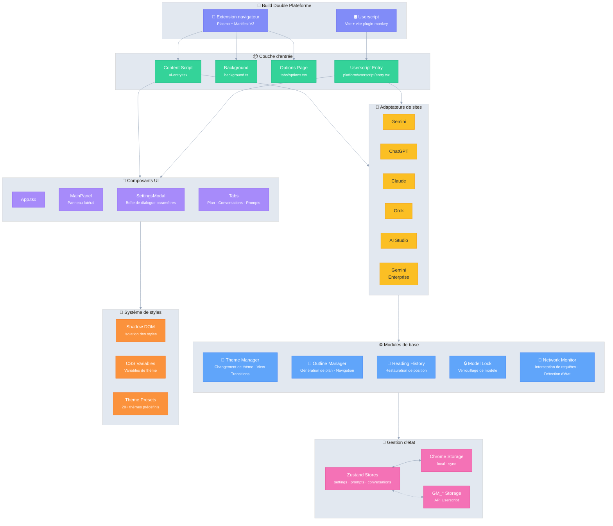

# Ophel 🚀

<p align="center">
  
</p>

<p align="center">
  <strong>✨ Les bienfaits de l'IA, à portée de main ✨</strong><br/>
  <em>AI's Benefit, Within Reach.</em>
</p>

<p align="center">
  <a href="../../LICENSE"></a>
  
  <a href="https://github.com/urzeye/ophel/stargazers"></a>
  <a href="https://opencollective.com/urzeye-oss"></a>
</p>

<p align="center">
  <a href="#-démo">Démo</a> •
  <a href="#-fonctionnalités-principales">Fonctionnalités</a> •
  <a href="#%EF%B8%8F-architecture-technique">Architecture technique</a> •
  <a href="#-démarrage-rapide">Démarrage rapide</a> •
  <a href="#-support">Soutenir le projet</a>
</p>

<p align="center">
  🌐 <a href="../../README_EN.md">English</a> | <a href="../../README.md">简体中文</a> | <a href="./README_zh-TW.md">繁體中文</a> | <a href="./README_ja.md">日本語</a> | <a href="./README_ko.md">한국어</a> | <a href="./README_de.md">Deutsch</a> | <strong>Français</strong> | <a href="./README_es.md">Español</a> | <a href="./README_pt.md">Português</a> | <a href="./README_ru.md">Русский</a>
</p>

---

👋 **Ophel** est un outil d'amélioration des pages de discussion IA prenant en charge à la fois les **extensions de navigateur** et les **userscripts**, offrant une expérience interactive unifiée pour les principales plateformes d'IA telles que **Gemini**, **ChatGPT**, **Claude**, **Grok** et **AI Studio**.

## 📹 Démo

|                                                          Outline                                                           |                                                       Conversations                                                        |                                                          Features                                                          |
| :------------------------------------------------------------------------------------------------------------------------: | :------------------------------------------------------------------------------------------------------------------------: | :------------------------------------------------------------------------------------------------------------------------: |
| <video src="https://github.com/user-attachments/assets/a40eb655-295e-4f9c-b432-9313c9242c9d" width="280" controls></video> | <video src="https://github.com/user-attachments/assets/a249baeb-2e82-4677-847c-2ff584c3f56b" width="280" controls></video> | <video src="https://github.com/user-attachments/assets/6dfca20d-2f88-4844-b3bb-c48321100ff4" width="280" controls></video> |

## ✨ Fonctionnalités principales

- 🧠 **Plan intelligent** — Analyse automatique des questions de l'utilisateur et des réponses de l'IA pour générer une table des matières navigable
- 💬 **Gestion des conversations** — Organisation par dossiers, étiquettes, recherche, opérations par lot
- ⌨️ **Bibliothèque de prompts** — Support des variables, aperçu Markdown, gestion des catégories, remplissage en un clic
- 🎨 **Personnalisation du thème** — Plus de 20 thèmes sombres/clairs, CSS personnalisé
- 🔧 **Optimisation de l'interface** — Mode écran large, ajustement de la largeur de la page, contrôle de la barre latérale
- 📖 **Expérience de lecture** — Verrouillage du défilement, restauration de l'historique de lecture, optimisation du rendu Markdown
- ⚡ **Outils de productivité** — Raccourcis clavier, verrouillage du modèle, renommage automatique des onglets, notifications
- 🎭 **Amélioration Claude** — Gestion des clés de session, changement de compte multiple
- 🔒 **Confidentialité avant tout** — Stockage local, synchronisation WebDAV, aucune collecte de données

## 🏗️ Architecture technique

**Stack technique** : [Plasmo](https://docs.plasmo.com/) + [React](https://react.dev/) + [TypeScript](https://www.typescriptlang.org/) + [Zustand](https://github.com/pmndrs/zustand)

<details>
<summary>📐 Diagramme d'architecture (cliquer pour déplier)</summary>



</details>

## 🚀 Démarrage rapide

> [!tip]
>
> **Il est recommandé d'utiliser la version extension de navigateur.** Elle offre plus de fonctionnalités, une meilleure expérience et une meilleure compatibilité. La version Userscript (Tampermonkey) est limitée (par exemple, pas d'accès aux cookies, pas de popups indépendants).

### Magasins d'applications

[Chrome](https://chromewebstore.google.com/detail/ophel-ai-%E5%AF%B9%E8%AF%9D%E5%A2%9E%E5%BC%BA%E5%B7%A5%E5%85%B7/lpcohdfbomkgepfladogodgeoppclakd) | [Firefox](https://addons.mozilla.org/zh-CN/firefox/addon/ophel-ai-chat-enhancer) | [Greasy Fork](https://greasyfork.org/zh-CN/scripts/563646-ophel)

### Installation manuelle

#### Extension de navigateur

1. Téléchargez et extrayez le paquet d'installation depuis [Releases](https://github.com/urzeye/ophel/releases).
2. Ouvrez la page de gestion des extensions de votre navigateur et activez le **Mode développeur**.
3. Cliquez sur **Charger l'extension non empaquetée** et sélectionnez le dossier extrait.

#### Userscript

1. Installez le plugin [Tampermonkey](https://www.tampermonkey.net/).
2. Téléchargez le fichier `.user.js` depuis [Releases](https://github.com/urzeye/ophel/releases).
3. Faites-le glisser dans le navigateur ou cliquez sur le lien pour l'installer.

### Build local

<details>
<summary>Click to expand build steps</summary>

**Requirements**: Node.js >= 20.x, pnpm >= 9.x

```bash
git clone https://github.com/urzeye/ophel.git
cd ophel
pnpm install
pnpm dev              # Development mode
pnpm build            # Chrome/Edge production build
pnpm build:firefox    # Firefox production build
pnpm build:userscript # Userscript production build
```

**Tech Stack**: [Plasmo](https://docs.plasmo.com/) + [React](https://react.dev/) + [TypeScript](https://www.typescriptlang.org/) + [Zustand](https://github.com/pmndrs/zustand)

</details>

### 🐛 Feedback

Pour toute question ou suggestion, n'hésitez pas à nous faire part de vos commentaires sur [GitHub Issues](https://github.com/urzeye/ophel/issues).

## ⭐ Star History

<a href="https://star-history.com/#urzeye/ophel&Date">
 <picture>
   <source media="(prefers-color-scheme: dark)" srcset="https://api.star-history.com/svg?repos=urzeye/ophel&type=Date&theme=dark" />
   <source media="(prefers-color-scheme: light)" srcset="https://api.star-history.com/svg?repos=urzeye/ophel&type=Date" />
   
 </picture>
</a>

## 💖 Soutenir le projet

<p align="center">
  <em>"If you want to go fast, go alone. If you want to go far, go together."</em>
</p>

<p align="center">
  If Ophel helps you, consider supporting:<br/><br/>
  <a href="https://opencollective.com/urzeye-oss">
    
  </a>
</p>

<p align="center">
  Made with ❤️ by <a href="https://github.com/urzeye">urzeye</a>
</p>

## 📜 Licence

This project is licensed under **CC BY-NC-SA 4.0**. See [LICENSE](../../LICENSE) for details.

> ⚠️ **Commercial packaging, resale, or unauthorized integration is prohibited.** For commercial licensing: **<igodu.love@gmail.com>**
