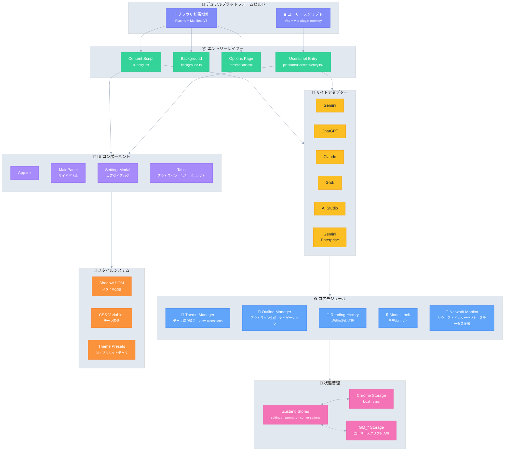

# Ophel 🚀

<p align="center">
  
</p>

<p align="center">
  <strong>✨ AIの恵みを、手元に ✨</strong><br/>
  <em>AI's Benefit, Within Reach.</em>
</p>

<p align="center">
  <a href="../../LICENSE"></a>
  
  <a href="https://github.com/urzeye/ophel/stargazers"></a>
  <a href="https://opencollective.com/urzeye-oss"></a>
</p>

<p align="center">
  <a href="#-デモ">デモ</a> •
  <a href="#-主な機能">主な機能</a> •
  <a href="#%EF%B8%8F-技術アーキテクチャ">技術アーキテクチャ</a> •
  <a href="#-今すぐ始める">今すぐ始める</a> •
  <a href="#-プロジェクトを支援">プロジェクトを支援</a>
</p>

<p align="center">
  🌐 <a href="../../README_EN.md">English</a> | <a href="../../README.md">简体中文</a> | <a href="./README_zh-TW.md">繁體中文</a> | <strong>日本語</strong> | <a href="./README_ko.md">한국어</a> | <a href="./README_de.md">Deutsch</a> | <a href="./README_fr.md">Français</a> | <a href="./README_es.md">Español</a> | <a href="./README_pt.md">Português</a> | <a href="./README_ru.md">Русский</a>
</p>

---

👋 **Ophel** は、**ブラウザ拡張機能**と**ユーザースクリプト**の両方をサポートする AI チャットページ強化ツールであり、**Gemini**、**ChatGPT**、**Claude**、**Grok**、**AI Studio** などの主要な AI プラットフォームに統一されたインタラクティブな体験を提供します。

## 📹 デモ

|                                                          Outline                                                           |                                                       Conversations                                                        |                                                          Features                                                          |
| :------------------------------------------------------------------------------------------------------------------------: | :------------------------------------------------------------------------------------------------------------------------: | :------------------------------------------------------------------------------------------------------------------------: |
| <video src="https://github.com/user-attachments/assets/a40eb655-295e-4f9c-b432-9313c9242c9d" width="280" controls></video> | <video src="https://github.com/user-attachments/assets/a249baeb-2e82-4677-847c-2ff584c3f56b" width="280" controls></video> | <video src="https://github.com/user-attachments/assets/6dfca20d-2f88-4844-b3bb-c48321100ff4" width="280" controls></video> |

## ✨ 主な機能

- 🧠 **スマートアウトライン** — ユーザーの質問と AI の回答を自動解析し、ナビゲーション可能な目次を生成
- 💬 **会話管理** — フォルダ分類、タグ付け、検索、一括操作
- ⌨️ **プロンプトライブラリ** — 変数サポート、Markdown プレビュー、分類管理、ワンクリック入力
- 🎨 **テーマカスタマイズ** — 20種類以上のダーク/ライトテーマ、カスタムCSS
- 🔧 **インターフェース最適化** — ワイドスクリーンモード、ページと質問幅の調整、サイドバーレイアウト制御
- 📖 **読書体験** — スクロールロック、読書履歴の復元、Markdown レンダリングの最適化
- ⚡ **効率化ツール** — ショートカットキー、モデルロック、タブ自動リネーム、完了通知
- 🎭 **Claude 拡張** — Session Key 管理、マルチアカウント切り替え
- 🔒 **プライバシー優先** — ローカルストレージ、WebDAV 同期、データ収集なし

## 🏗️ 技術アーキテクチャ

**技術スタック**：[Plasmo](https://docs.plasmo.com/) + [React](https://react.dev/) + [TypeScript](https://www.typescriptlang.org/) + [Zustand](https://github.com/pmndrs/zustand)

<details>
<summary>📐 アーキテクチャ図（クリックして展開）</summary>



</details>

## 🚀 今すぐ始める

> [!tip]
>
> **ブラウザ拡張機能（Extension）版の使用を推奨します**。機能が充実しており、体験も優れ、互換性も高いです。Tampermonkey（Userscript）版は機能が制限されています（例：Cookieの読み取り不可、独立したポップアップなしなど）。

### アプリストア

[Chrome](https://chromewebstore.google.com/detail/ophel-ai-%E5%AF%B9%E8%AF%9D%E5%A2%9E%E5%BC%BA%E5%B7%A5%E5%85%B7/lpcohdfbomkgepfladogodgeoppclakd) | [Firefox](https://addons.mozilla.org/zh-CN/firefox/addon/ophel-ai-chat-enhancer) | [Greasy Fork](https://greasyfork.org/zh-CN/scripts/563646-ophel)

### 手動インストール

#### ブラウザ拡張機能

1. [Releases](https://github.com/urzeye/ophel/releases) からインストールパッケージをダウンロードして解凍します
2. ブラウザの拡張機能管理ページを開き、**デベロッパーモード**を有効にします
3. **パッケージ化されていない拡張機能を読み込む**をクリックし、解凍したフォルダを選択します

#### Tampermonkey スクリプト

1. [Tampermonkey](https://www.tampermonkey.net/) プラグインをインストールします
2. [Releases](https://github.com/urzeye/ophel/releases) から `.user.js` ファイルをダウンロードします
3. ブラウザにドラッグするか、リンクをクリックしてインストールします

### ローカルビルド

<details>
<summary>Click to expand build steps</summary>

**Requirements**: Node.js >= 20.x, pnpm >= 9.x

```bash
git clone https://github.com/urzeye/ophel.git
cd ophel
pnpm install
pnpm dev              # Development mode
pnpm build            # Chrome/Edge production build
pnpm build:firefox    # Firefox production build
pnpm build:userscript # Userscript production build
```

**Tech Stack**: [Plasmo](https://docs.plasmo.com/) + [React](https://react.dev/) + [TypeScript](https://www.typescriptlang.org/) + [Zustand](https://github.com/pmndrs/zustand)

</details>

### 🐛 バグ報告

問題や提案がある場合は、[GitHub Issues](https://github.com/urzeye/ophel/issues) でフィードバックしてください。

## ⭐ Star History

<a href="https://star-history.com/#urzeye/ophel&Date">
 <picture>
   <source media="(prefers-color-scheme: dark)" srcset="https://api.star-history.com/svg?repos=urzeye/ophel&type=Date&theme=dark" />
   <source media="(prefers-color-scheme: light)" srcset="https://api.star-history.com/svg?repos=urzeye/ophel&type=Date" />
   
 </picture>
</a>

## 💖 プロジェクトを支援

<p align="center">
  <em>"If you want to go fast, go alone. If you want to go far, go together."</em>
</p>

<p align="center">
  If Ophel helps you, consider supporting:<br/><br/>
  <a href="https://opencollective.com/urzeye-oss">
    
  </a>
</p>

<p align="center">
  Made with ❤️ by <a href="https://github.com/urzeye">urzeye</a>
</p>

## 📜 ライセンス

This project is licensed under **CC BY-NC-SA 4.0**. See [LICENSE](../../LICENSE) for details.

> ⚠️ **Commercial packaging, resale, or unauthorized integration is prohibited.** For commercial licensing: **<igodu.love@gmail.com>**
