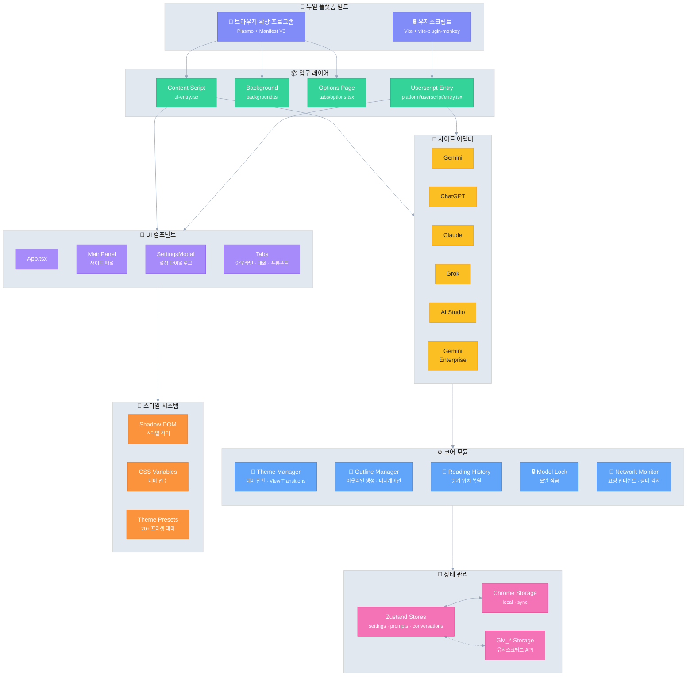

# Ophel 🚀

<p align="center">
  
</p>

<p align="center">
  <strong>✨ AI의 혜택, 손이 닿는 곳에 ✨</strong><br/>
  <em>AI's Benefit, Within Reach.</em>
</p>

<p align="center">
  <a href="../../LICENSE"></a>
  
  <a href="https://github.com/urzeye/ophel/stargazers"></a>
  <a href="https://opencollective.com/urzeye-oss"></a>
</p>

<p align="center">
  <a href="#-데모">데모</a> •
  <a href="#-핵심-기능">핵심 기능</a> •
  <a href="#%EF%B8%8F-기술-아키텍처">기술 아키텍처</a> •
  <a href="#-빠른-시작">빠른 시작</a> •
  <a href="#-프로젝트-후원">프로젝트 후원</a>
</p>

<p align="center">
  🌐 <a href="../../README_EN.md">English</a> | <a href="../../README.md">简体中文</a> | <a href="./README_zh-TW.md">繁體中文</a> | <a href="./README_ja.md">日本語</a> | <strong>한국어</strong> | <a href="./README_de.md">Deutsch</a> | <a href="./README_fr.md">Français</a> | <a href="./README_es.md">Español</a> | <a href="./README_pt.md">Português</a> | <a href="./README_ru.md">Русский</a>
</p>

---

👋 **Ophel**은 **브라우저 확장 프로그램**과 **유저스크립트**를 모두 지원하는 AI 채팅 페이지 향상 도구로, **Gemini**, **ChatGPT**, **Claude**, **Grok**, **AI Studio** 등 주류 AI 플랫폼에 대해 통일된 상호 작용 경험을 제공합니다.

## 📹 데모

|                                                          Outline                                                           |                                                       Conversations                                                        |                                                          Features                                                          |
| :------------------------------------------------------------------------------------------------------------------------: | :------------------------------------------------------------------------------------------------------------------------: | :------------------------------------------------------------------------------------------------------------------------: |
| <video src="https://github.com/user-attachments/assets/a40eb655-295e-4f9c-b432-9313c9242c9d" width="280" controls></video> | <video src="https://github.com/user-attachments/assets/a249baeb-2e82-4677-847c-2ff584c3f56b" width="280" controls></video> | <video src="https://github.com/user-attachments/assets/6dfca20d-2f88-4844-b3bb-c48321100ff4" width="280" controls></video> |

## ✨ 핵심 기능

- 🧠 **스마트 아웃라인** — 사용자 질문과 AI 답변을 자동 분석하여 탐색 가능한 목차 생성
- 💬 **대화 관리** — 폴더 분류, 태그, 검색, 일괄 작업
- ⌨️ **프롬프트 라이브러리** — 변수 지원, 마크다운 미리보기, 분류 관리, 원클릭 입력
- 🎨 **테마 커스터마이징** — 20+ 다크/라이트 테마, 사용자 정의 CSS
- 🔧 **인터페이스 최적화** — 와이드 스크린 모드, 페이지 및 질문 너비 조정, 사이드바 레이아웃 제어
- 📖 **독서 경험** — 스크롤 잠금, 독서 기록 복원, 마크다운 렌더링 최적화
- ⚡ **생산성 도구** — 단축키, 모델 잠금, 탭 자동 이름 변경, 완료 알림
- 🎭 **Claude 향상** — 세션 키 관리, 다중 계정 전환
- 🔒 **개인정보 보호 우선** — 로컬 저장소, WebDAV 동기화, 데이터 수집 없음

## 🏗️ 기술 아키텍처

**기술 스택**: [Plasmo](https://docs.plasmo.com/) + [React](https://react.dev/) + [TypeScript](https://www.typescriptlang.org/) + [Zustand](https://github.com/pmndrs/zustand)

<details>
<summary>📐 아키텍처 다이어그램 (클릭하여 확장)</summary>



</details>

## 🚀 빠른 시작

> [!tip]
>
> **브라우저 확장 프로그램(Extension) 버전을 사용하는 것이 좋습니다.** 기능이 더 완벽하고 경험이 좋으며 호환성이 뛰어납니다. 유저스크립트(Tampermonkey) 버전은 기능이 제한적입니다(예: 쿠키 읽기 불가, 독립 팝업 없음 등).

### 앱 스토어

[Chrome](https://chromewebstore.google.com/detail/ophel-ai-%E5%AF%B9%E8%AF%9D%E5%A2%9E%E5%BC%BA%E5%B7%A5%E5%85%B7/lpcohdfbomkgepfladogodgeoppclakd) | [Firefox](https://addons.mozilla.org/zh-CN/firefox/addon/ophel-ai-chat-enhancer) | [Greasy Fork](https://greasyfork.org/zh-CN/scripts/563646-ophel)

### 수동 설치

#### 브라우저 확장 프로그램

1. [Releases](https://github.com/urzeye/ophel/releases)에서 설치 패키지를 다운로드하고 압축을 풉니다.
2. 브라우저 확장 프로그램 관리 페이지를 열고 **개발자 모드**를 켭니다.
3. **압축 해제된 확장 프로그램 로드**를 클릭하고 압축 푼 폴더를 선택합니다.

#### 유저스크립트

1. [Tampermonkey](https://www.tampermonkey.net/) 플러그인을 설치합니다.
2. [Releases](https://github.com/urzeye/ophel/releases)에서 `.user.js` 파일을 다운로드합니다.
3. 브라우저에 드래그하거나 링크를 클릭하여 설치합니다.

### 로컬 빌드

<details>
<summary>Click to expand build steps</summary>

**Requirements**: Node.js >= 20.x, pnpm >= 9.x

```bash
git clone https://github.com/urzeye/ophel.git
cd ophel
pnpm install
pnpm dev              # Development mode
pnpm build            # Chrome/Edge production build
pnpm build:firefox    # Firefox production build
pnpm build:userscript # Userscript production build
```

**Tech Stack**: [Plasmo](https://docs.plasmo.com/) + [React](https://react.dev/) + [TypeScript](https://www.typescriptlang.org/) + [Zustand](https://github.com/pmndrs/zustand)

</details>

### 🐛 피드백

문제나 제안 사항이 있으면 [GitHub Issues](https://github.com/urzeye/ophel/issues)에 피드백을 남겨주세요.

## ⭐ Star History

<a href="https://star-history.com/#urzeye/ophel&Date">
 <picture>
   <source media="(prefers-color-scheme: dark)" srcset="https://api.star-history.com/svg?repos=urzeye/ophel&type=Date&theme=dark" />
   <source media="(prefers-color-scheme: light)" srcset="https://api.star-history.com/svg?repos=urzeye/ophel&type=Date" />
   
 </picture>
</a>

## 💖 프로젝트 후원

<p align="center">
  <em>"If you want to go fast, go alone. If you want to go far, go together."</em>
</p>

<p align="center">
  If Ophel helps you, consider supporting:<br/><br/>
  <a href="https://opencollective.com/urzeye-oss">
    
  </a>
</p>

<p align="center">
  Made with ❤️ by <a href="https://github.com/urzeye">urzeye</a>
</p>

## 📜 라이선스

This project is licensed under **CC BY-NC-SA 4.0**. See [LICENSE](../../LICENSE) for details.

> ⚠️ **Commercial packaging, resale, or unauthorized integration is prohibited.** For commercial licensing: **<igodu.love@gmail.com>**
