# Ophel 🚀

> AI 대화를 문서처럼 읽기 쉽고, 탐색 가능하며, 재사용할 수 있게 만듭니다

<div align="center">
  

  <h3 style="margin-top: -2px;">✨ 대화를 단순한 기록이 아닌 지식으로 바꾸세요 ✨</h3>
  
  <p>
    무한 스크롤 속 정보의 미궁과 작별하세요
    </br>
    실시간 개요로 맥락을 정리하고,
    </br>
    대화 폴더로 체계를 구축하며,
    </br>
    프롬프트 라이브러리로 경험을 축적하고,
    </br>
    반짝이는 생각들이 질서 속에서 자유롭게 흐르게 하세요
  </p>
  
  <p align="center" style="font-size: 12px; color: #555;">👇 데모: "무한 스크롤 채팅 기록"에서 "탐색 가능한 AI 문서"로</p>
  
  
  <p>
    <strong><em>AI 채팅을 처음으로 정리 가능한 워크플로우로 만듭니다</em></strong><br/>
  </p>

  <small style="opacity: 0.6;">
  어떤 플랫폼을 사용하든, 일관되고 정리 가능하며 재사용 가능한 경험을 얻을 수 있습니다
  </small>
  <p>
    <a href="https://chatgpt.com"></a>
    <a href="https://gemini.google.com"></a>
    <a href="https://grok.com"></a>
    <a href="https://claude.ai"></a>
    <a href="https://aistudio.google.com"></a>
    <a href="https://business.gemini.google/"></a>
    <a href="https://github.com/urzeye/ophel/issues"></a>
    </br>
    
    <a href="../../LICENSE"></a>
    
    <a href="https://github.com/urzeye/ophel/stargazers"></a>
    <a href="https://github.com/urzeye/ophel/network/members"></a>
    </br>
    <a href="https://chromewebstore.google.com/detail/ophel-ai-%E5%AF%B9%E8%AF%9D%E5%A2%9E%E5%BC%BA%E5%B7%A5%E5%85%B7/lpcohdfbomkgepfladogodgeoppclakd"></a>
    <a href="https://addons.mozilla.org/zh-CN/firefox/addon/ophel-ai-chat-enhancer/"></a>
    <a href="https://greasyfork.org/zh-CN/scripts/563646-ophel-ai-chat-page-enhancer"></a>
  </p>

</div>

<!-- Promo Link -->
<p align="center">
  📣 <a href="https://github.com/urzeye/ophel/issues/30">
    <strong>Help promote Ophel / 帮忙宣传 Ophel</strong>
  </a>
  <br/>
  <a href="https://www.producthunt.com/products/ophel?embed=true&utm_source=badge-featured&utm_medium=badge&utm_campaign=badge-ophel" target="_blank" rel="noopener noreferrer"></a>
</p>

<p align="center">
  <a href="#-기능-데모">기능 데모</a> •
  <a href="#-핵심-기능">핵심 기능</a> •
  <a href="#-시작하기">시작하기</a> •
  <a href="#%EF%B8%8F-기술 아키텍처">기술 아키텍처</a> •
  <a href="#-프로젝트-후원">프로젝트 후원</a>
</p>

<p align="center">
  🌐 <a href="../../README_EN.md">English</a> | <a href="../../README.md">简体中文</a> | <a href="./README_zh-TW.md">繁體中文</a> | <a href="./README_ja.md">日本語</a> | <strong>한국어</strong> | <a href="./README_de.md">Deutsch</a> | <a href="./README_fr.md">Français</a> | <a href="./README_es.md">Español</a> | <a href="./README_pt.md">Português</a> | <a href="./README_ru.md">Русский</a>
</p>

## 📹 기능 데모

|                                                        개요 Outline                                                        |                                                     대화 Conversations                                                     |                                                       기능 Features                                                        |
| :------------------------------------------------------------------------------------------------------------------------: | :------------------------------------------------------------------------------------------------------------------------: | :------------------------------------------------------------------------------------------------------------------------: |
| <video src="https://github.com/user-attachments/assets/a40eb655-295e-4f9c-b432-9313c9242c9d" width="280" controls></video> | <video src="https://github.com/user-attachments/assets/a249baeb-2e82-4677-847c-2ff584c3f56b" width="280" controls></video> | <video src="https://github.com/user-attachments/assets/6dfca20d-2f88-4844-b3bb-c48321100ff4" width="280" controls></video> |

## ✨ 핵심 기능

- 🧠 **스마트 개요** — 사용자 질문과 AI 답변을 자동으로 분석하여 탐색 가능한 목차 생성
- 💬 **대화 관리** — 폴더 분류, 태그, 검색, 일괄 작업
- ⌨️ **프롬프트 라이브러리** — 변수 지원, 마크다운 미리보기, 분류 관리, 원클릭 입력
- 🎨 **테마 커스터마이징** — 20종 이상의 다크/라이트 테마, 사용자 정의 CSS
- 🔧 **인터페이스 최적화** — 와이드스크린 모드, 페이지 및 채팅 너비 조정, 사이드바 레이아웃 제어
- 📖 **읽기 환경** — 스크롤 잠금, 읽기 위치 복구, 마크다운 렌더링 최적화
- ⚡ **생산성 도구** — 단축키, 모델 잠금, 탭 자동 이름 지정, 완료 알림
- 🎭 **Claude 확장** — Session Key 관리, 다중 계정 전환
- 🔒 **개인정보 우선** — 로컬 저장소, WebDAV 동기화, 데이터 수집 없음

## 🚀 시작하기

> [!tip]
>
> **브라우저 확장 프로그램(Extension) 버전 사용을 권장합니다**. 기능이 더 완벽하고 경험이 좋으며 호환성이 뛰어납니다. 유저스크립트(Tampermonkey) 버전은 기능이 제한적입니다.

### 앱 스토어

<a href="https://chromewebstore.google.com/detail/ophel-ai-%E5%AF%B9%E8%AF%9D%E5%A2%9E%E5%BC%BA%E5%B7%A5%E5%85%B7/lpcohdfbomkgepfladogodgeoppclakd"></a>
<a href="https://addons.mozilla.org/zh-CN/firefox/addon/ophel-ai-chat-enhancer/"></a>
<a href="https://greasyfork.org/zh-CN/scripts/563646-ophel-ai-chat-page-enhancer"></a>

### 수동 설치

#### 브라우저 확장 프로그램

1. [Releases](https://github.com/urzeye/ophel/releases/latest) 에서 설치 패키지를 다운로드하고 압축을 풉니다
2. 브라우저 확장 프로그램 관리 페이지를 열고 **개발자 모드**를 켭니다
3. **압축 해제된 확장 프로그램을 로드합니다**를 클릭하고 압축을 푼 폴더를 선택합니다

#### 유저스크립트(Tampermonkey)

1. [Tampermonkey](https://www.tampermonkey.net/) 플러그인을 설치합니다
2. [Releases](https://github.com/urzeye/ophel/releases) 에서 `.user.js` 파일을 다운로드합니다
3. 브라우저로 드래그하거나 링크를 클릭하여 설치합니다

### 로컬 빌드

<details>
<summary>빌드 단계 펼치기</summary>

**요구 사항**: Node.js >= 20.x, pnpm >= 9.x

```bash
git clone https://github.com/urzeye/ophel.git
cd ophel

pnpm install
pnpm dev              # 개발 모드
pnpm build            # Chrome/Edge 프로덕션 빌드
pnpm build:firefox    # Firefox 프로덕션 빌드
pnpm build:userscript # Userscript 프로덕션 빌드
```

</details>

## 🏗️ 기술 아키텍처

**기술 스택**: [Plasmo](https://docs.plasmo.com/) + [React](https://react.dev/) + [TypeScript](https://www.typescriptlang.org/) + [Zustand](https://github.com/pmndrs/zustand)

```mermaid
%%{init: {'theme': 'base', 'themeVariables': { 'primaryColor': '#6366f1', 'primaryTextColor': '#fff', 'primaryBorderColor': '#4f46e5', 'lineColor': '#94a3b8', 'secondaryColor': '#f1f5f9', 'tertiaryColor': '#e2e8f0', 'background': '#ffffff'}}}%%
flowchart TB
    subgraph Platforms["🚀 듀얼 플랫폼 빌드"]
        direction LR
        EXT["🧩 브라우저 확장<br/><small>Plasmo + Manifest V3</small>"]
        US["🛢️ 유저스크립트<br/><small>Vite + vite-plugin-monkey</small>"]
    end

    subgraph Entry["📦 진입 계층"]
        direction LR
        CE["Content Script<br/><small>ui-entry.tsx</small>"]
        BG["Background<br/><small>background.ts</small>"]
        OPT["Options Page<br/><small>tabs/options.tsx</small>"]
        USE["Userscript Entry<br/><small>platform/userscript/entry.tsx</small>"]
    end

    subgraph Adapters["🔌 사이트 어댑터"]
        direction LR
        GEM["Gemini"]
        GPT["ChatGPT"]
        CLA["Claude"]
        GRK["Grok"]
        AIS["AI Studio"]
        GEE["Gemini<br/>Enterprise"]
    end

    subgraph Core["⚙️ 핵심 모듈"]
        direction TB
        TM["🎨 Theme Manager<br/><small>테마 전환 · View Transitions</small>"]
        OM["📑 Outline Manager<br/><small>개요 생성 · 내비게이션</small>"]
        RH["📖 Reading History<br/><small>읽기 위치 복원</small>"]
        ML["🔒 Model Lock<br/><small>모델 잠금</small>"]
        NM["📡 Network Monitor<br/><small>요청 가로채기 · 상태 감지</small>"]
    end

    subgraph State["💾 상태 관리"]
        direction LR
        ZS["Zustand Stores<br/><small>settings · prompts · conversations</small>"]
        CS["Chrome Storage<br/><small>local · sync</small>"]
        GM["GM_* Storage<br/><small>유저스크립트 API</small>"]
    end

    subgraph UI["🎯 UI 컴포넌트"]
        direction TB
        APP["App.tsx"]
        MP["MainPanel<br/><small>사이드 패널</small>"]
        SM["SettingsModal<br/><small>설정 모달</small>"]
        TABS["Tabs<br/><small>개요 · 대화 · 프롬프트</small>"]
    end

    subgraph CSS["🎨 스타일 시스템"]
        direction LR
        SD["Shadow DOM<br/><small>스타일 격리</small>"]
        TV["CSS Variables<br/><small>테마 변수</small>"]
        TH["Theme Presets<br/><small>20+ 프리셋 테마</small>"]
    end

    %% Connections
    EXT --> CE & BG & OPT
    US --> USE

    CE --> Adapters
    USE --> Adapters

    Adapters --> Core
    Core --> State

    CE --> UI
    USE --> UI
    UI --> CSS

    ZS <--> CS
    ZS <-.-> GM

    %% Styles
    classDef platform fill:#818cf8,stroke:#6366f1,color:#fff
    classDef entry fill:#34d399,stroke:#10b981,color:#fff
    classDef adapter fill:#fbbf24,stroke:#f59e0b,color:#1f2937
    classDef core fill:#60a5fa,stroke:#3b82f6,color:#fff
    classDef state fill:#f472b6,stroke:#ec4899,color:#fff
    classDef ui fill:#a78bfa,stroke:#8b5cf6,color:#fff
    classDef css fill:#fb923c,stroke:#f97316,color:#fff

    class EXT,US platform
    class CE,BG,OPT,USE entry
    class GEM,GPT,CLA,GRK,AIS,GEE adapter
    class TM,OM,RH,ML,NM core
    class ZS,CS,GM state
    class APP,MP,SM,TABS ui
    class SD,TV,TH css
```

<details>
<summary>📐 아키텍처 다이어그램 (클릭하여 펼치기)</summary>



</details>

### 🐛 버그 제보

문제가 있거나 제안 사항이 있으면 [GitHub Issues](https://github.com/urzeye/ophel/issues) 에 피드백을 남겨주세요.

## ⭐ Star History

<a href="https://star-history.com/#urzeye/ophel&Date">
 <picture>
   <source media="(prefers-color-scheme: dark)" srcset="https://api.star-history.com/svg?repos=urzeye/ophel&type=Date&theme=dark" />
   <source media="(prefers-color-scheme: light)" srcset="https://api.star-history.com/svg?repos=urzeye/ophel&type=Date" />
   
 </picture>
</a>

## 💖 프로젝트 후원

<p align="center">
  <em>"If you want to go fast, go alone. If you want to go far, go together."</em>
</p>

<p align="center">
  이 도구가 여러분의 업무나 학습 워크플로우를 개선하는 데 도움이 되었다면, Star나 Sponsor로 지원해 주세요. Ophel이 더 발전할 수 있도록 힘이 됩니다.
</p>

<p align="center">
  Made with ❤️ by <a href="https://github.com/urzeye">urzeye</a>
</p>

## 📜 라이선스

이 프로젝트는 **CC BY-NC-SA 4.0** 라이선스를 따릅니다. 자세한 내용은 [LICENSE](../../LICENSE) 를 참조하세요.

> ⚠️ **상업적 패키징, 재판매 또는 무단 통합은 금지됩니다.** 상업용 라이선스 문의: **<igodu.love@gmail.com>**
