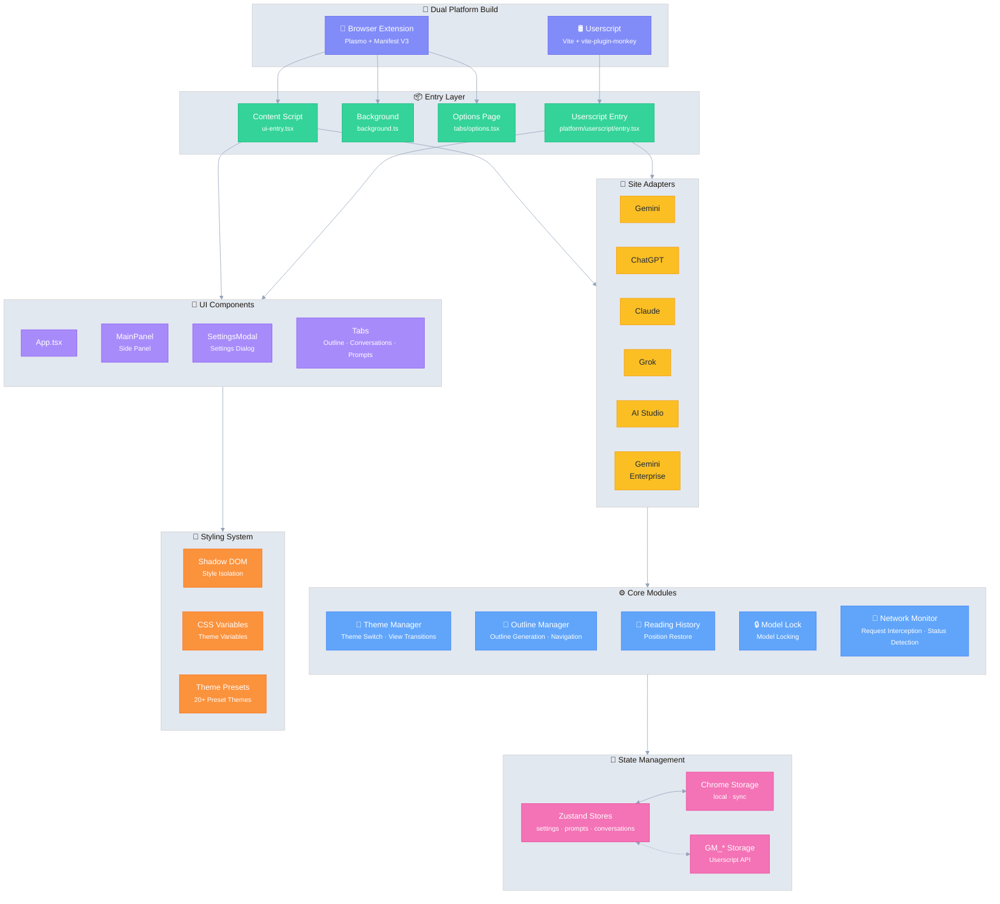

# Ophel 🚀

> Превратите AI-чаты в читаемые, навигационные и многоразовые документы

<div align="center">
  

  <h3 style="margin-top: -2px;">✨ Превратите Разговоры в Знания, а Не Просто в Историю ✨</h3>
  
  <p>
    Хватит теряться в бесконечной прокрутке. Проясните контекст с помощью живых оглавлений, постройте свою систему с папками разговоров, улучшите опыт с библиотекой промптов и позвольте блестящим мыслям свободно течь в порядке.
  </p>
  
  <p align="center" style="font-size: 12px; color: #555;">👇 Демо: От "Бесконечной прокрутки чата" к "Навигационным AI документам"</p>
  
  
  <p>
    <strong><em>Делая AI-чат действительно организуемым рабочим процессом впервые</em></strong><br/>
  </p>

  <small style="opacity: 0.6;">
  Независимо от того, какую платформу вы используете, Ophel позволяет организовать разговоры в многоразовые рабочие процессы с последовательным и единым опытом.
  </small>
  <p>
    <a href="https://chatgpt.com"></a>
    <a href="https://gemini.google.com"></a>
    <a href="https://grok.com"></a>
    <a href="https://claude.ai"></a>
    <a href="https://aistudio.google.com"></a>
    <a href="https://business.gemini.google/"></a>
    <a href="https://github.com/urzeye/ophel/issues"></a>
    </br>
    
    <a href="../../LICENSE"></a>
    
    <a href="https://github.com/urzeye/ophel/stargazers"></a>
    <a href="https://github.com/urzeye/ophel/network/members"></a>
    </br>
    <a href="https://chromewebstore.google.com/detail/ophel-ai-%E5%AF%B9%E8%AF%9D%E5%A2%9E%E5%BC%BA%E5%B7%A5%E5%85%B7/lpcohdfbomkgepfladogodgeoppclakd"></a>
    <a href="https://addons.mozilla.org/zh-CN/firefox/addon/ophel-ai-chat-enhancer/"></a>
    <a href="https://greasyfork.org/zh-CN/scripts/563646-ophel-ai-chat-page-enhancer"></a>
  </p>

</div>

<!-- Promo Link -->
<p align="center">
  📣 <a href="https://github.com/urzeye/ophel/issues/30">
    <strong>Help promote Ophel</strong>
  </a>
  <br/>
  <a href="https://www.producthunt.com/products/ophel?embed=true&utm_source=badge-featured&utm_medium=badge&utm_campaign=badge-ophel" target="_blank" rel="noopener noreferrer"></a>
</p>

<p align="center">
  <a href="#-демо">Демо</a> •
  <a href="#-основные-функции">Основные Функции</a> •
  <a href="#-быстрый-старт">Быстрый Старт</a> •
  <a href="#%EF%B8%8F-архитектура">Архитектура</a> •
  <a href="#-поддержка">Поддержка</a>
</p>

<p align="center">
  🌐 <a href="../../README_EN.md">English</a> | <a href="../../README.md">简体中文</a> | <a href="./README_zh-TW.md">繁體中文</a> | <a href="./README_ja.md">日本語</a> | <a href="./README_ko.md">한국어</a> | <a href="./README_de.md">Deutsch</a> | <a href="./README_fr.md">Français</a> | <a href="./README_es.md">Español</a> | <a href="./README_pt.md">Português</a> | <strong>Русский</strong>
</p>

## 📹 Демо

|                                                          Outline                                                           |                                                       Conversations                                                        |                                                          Features                                                          |
| :------------------------------------------------------------------------------------------------------------------------: | :------------------------------------------------------------------------------------------------------------------------: | :------------------------------------------------------------------------------------------------------------------------: |
| <video src="https://github.com/user-attachments/assets/a40eb655-295e-4f9c-b432-9313c9242c9d" width="280" controls></video> | <video src="https://github.com/user-attachments/assets/a249baeb-2e82-4677-847c-2ff584c3f56b" width="280" controls></video> | <video src="https://github.com/user-attachments/assets/6dfca20d-2f88-4844-b3bb-c48321100ff4" width="280" controls></video> |

## ✨ Основные Функции

- 🧠 **Smart Outline** — Автоматический анализ запросов и ответов в навигационное оглавление
- 💬 **Conversation Manager** — Папки, теги, поиск, массовые операции
- ⌨️ **Prompt Library** — Переменные, превью Markdown, категории, вставка одним кликом
- 🎨 **Настройка Темы** — 20+ темных/светлых тем, кастомный CSS
- 🔧 **Оптимизация UI** — Широкоформатный режим, контроль ширины, макет боковой панели
- 📖 **Опыт Чтения** — Блокировка прокрутки, восстановление позиции, рендеринг Markdown
- ⚡ **Продуктивность** — Горячие клавиши, блокировка модели, авто-переименование, уведомления
- 🎭 **Улучшение Claude** — Управление ключом сессии, переключение аккаунтов
- 🔒 **Приватность** — Локальное хранение, WebDAV синхронизация, без сбора данных

## 🚀 Быстрый Старт

> [!tip]
>
> **Настоятельно рекомендуем использовать версию расширения для браузера** для более полного набора функций, лучшего опыта и высокой совместимости. Версия Userscript имеет ограничения.

### Web Store

<a href="https://chromewebstore.google.com/detail/ophel-ai-%E5%AF%B9%E8%AF%9D%E5%A2%9E%E5%BC%BA%E5%B7%A5%E5%85%B7/lpcohdfbomkgepfladogodgeoppclakd"></a>
<a href="https://addons.mozilla.org/zh-CN/firefox/addon/ophel-ai-chat-enhancer/"></a>
<a href="https://greasyfork.org/zh-CN/scripts/563646-ophel-ai-chat-page-enhancer"></a>

### Ручная Установка

#### Расширение Браузера

1. Скачайте и распакуйте архив из [Releases](https://github.com/urzeye/ophel/releases/latest)
2. Откройте страницу управления расширениями, включите **Режим разработчика**
3. Нажмите **Загрузить распакованное расширение** и выберите папку

#### Userscript

1. Установите [Tampermonkey](https://www.tampermonkey.net/)
2. Скачайте файл `.user.js` из [Releases](https://github.com/urzeye/ophel/releases)
3. Перетащите в браузер или нажмите на ссылку для установки

### Локальная Сборка

<details>
<summary>Нажмите, чтобы развернуть шаги сборки</summary>

**Требования**: Node.js >= 20.x, pnpm >= 9.x

```bash
git clone https://github.com/urzeye/ophel.git
cd ophel

pnpm install
pnpm dev              # Режим разработки
pnpm build            # Продакшн сборка Chrome/Edge
pnpm build:firefox    # Продакшн сборка Firefox
pnpm build:userscript # Продакшн сборка Userscript
```

</details>

## 🏗️ Архитектура

**Tech Stack**: [Plasmo](https://docs.plasmo.com/) + [React](https://react.dev/) + [TypeScript](https://www.typescriptlang.org/) + [Zustand](https://github.com/pmndrs/zustand)

<details>
<summary>📐 Диаграмма Архитектуры (кликните, чтобы развернуть)</summary>



</details>

### 🐛 Сообщить об Ошибке

Для проблем или предложений посетите [GitHub Issues](https://github.com/urzeye/ophel/issues).

## ⭐ Star History

<a href="https://star-history.com/#urzeye/ophel&Date">
 <picture>
   <source media="(prefers-color-scheme: dark)" srcset="https://api.star-history.com/svg?repos=urzeye/ophel&type=Date&theme=dark" />
   <source media="(prefers-color-scheme: light)" srcset="https://api.star-history.com/svg?repos=urzeye/ophel&type=Date" />
   
 </picture>
</a>

## 💖 Поддержка

<p align="center">
  <em>"If you want to go fast, go alone. If you want to go far, go together."</em>
</p>

<p align="center">
  Если Ophel улучшает ваш рабочий процесс, рассмотрите возможность поддержки через Star или Sponsor, чтобы помочь нам идти дальше.
</p>

<p align="center">
  Made with ❤️ by <a href="https://github.com/urzeye">urzeye</a>
</p>

## 📜 Лицензия

Этот проект лицензирован под **CC BY-NC-SA 4.0**. См. [LICENSE](../../LICENSE) для деталей.

> ⚠️ **Коммерческая переупаковка, перепродажа или несанкционированная интеграция запрещены.** По вопросам коммерческого лицензирования: **<igodu.love@gmail.com>**
