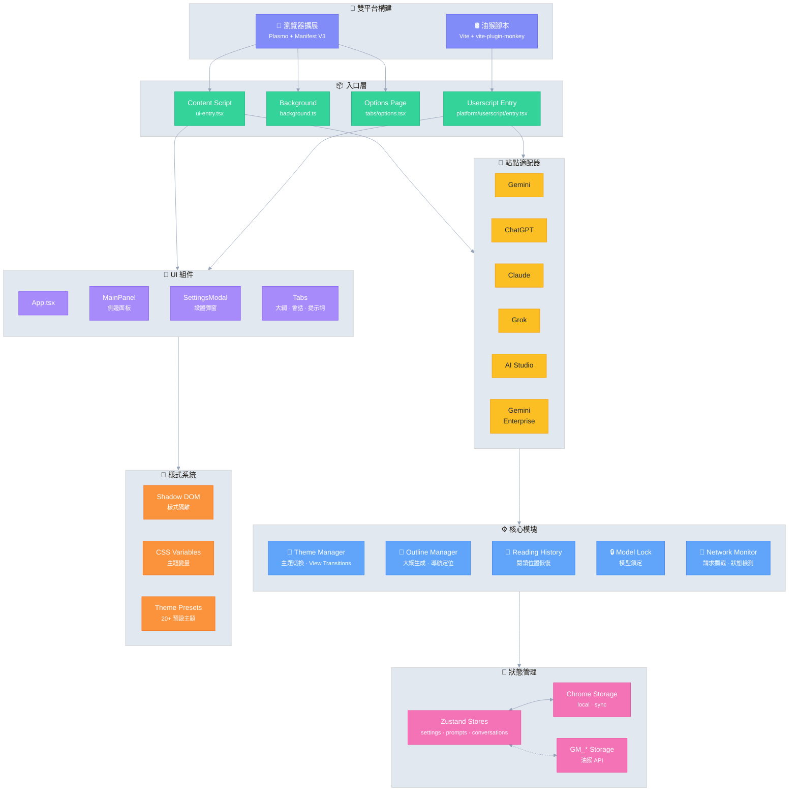

# Ophel 🚀

> 讓 AI 對話如文檔般可閱讀、導航、複用

<div align="center">
  

  <h3 style="margin-top: -2px;">✨ 把對話變成知識，而不是歷史 ✨</h3>
  
  <p>
    告別無限滾動帶來的資訊迷航
    </br>
    用實時大綱釐清脈絡，
    </br>
    用會話文件夾構築體系，
    </br>
    用 Prompt 詞庫沉澱經驗，
    </br>
    讓那些閃光的思考在秩序中自由流動
  </p>
  
  <p align="center" style="font-size: 12px; color: #555;">👇 Demo: 從“無限滾動的聊天記錄”，到“可導航的 AI 文檔”</p>
  
  
  <p>
    <strong><em>它讓 AI 對話第一次成為可組織的工作流</em></strong><br/>
  </p>

  <small style="opacity: 0.6;">
  無論你使用哪個平台，都可以以同一種方式，獲得一致、可組織且可重用的體驗
  </small>
  <p>
    <a href="https://chatgpt.com"></a>
    <a href="https://gemini.google.com"></a>
    <a href="https://grok.com"></a>
    <a href="https://claude.ai"></a>
    <a href="https://aistudio.google.com"></a>
    <a href="https://business.gemini.google/"></a>
    <a href="https://github.com/urzeye/ophel/issues"></a>
    </br>
    
    <a href="../../LICENSE"></a>
    
    <a href="https://github.com/urzeye/ophel/stargazers"></a>
    <a href="https://github.com/urzeye/ophel/network/members"></a>
    </br>
    <a href="https://chromewebstore.google.com/detail/ophel-ai-%E5%AF%B9%E8%AF%9D%E5%A2%9E%E5%BC%BA%E5%B7%A5%E5%85%B7/lpcohdfbomkgepfladogodgeoppclakd"></a>
    <a href="https://addons.mozilla.org/zh-CN/firefox/addon/ophel-ai-chat-enhancer/"></a>
    <a href="https://greasyfork.org/zh-CN/scripts/563646-ophel-ai-chat-page-enhancer"></a>
  </p>

</div>

<!-- Promo Link -->
<p align="center">
  📣 <a href="https://github.com/urzeye/ophel/issues/30">
    <strong>Help promote Ophel / 幫忙宣傳 Ophel</strong>
  </a>
  <br/>
  <a href="https://www.producthunt.com/products/ophel?embed=true&utm_source=badge-featured&utm_medium=badge&utm_campaign=badge-ophel" target="_blank" rel="noopener noreferrer"></a>
</p>

<p align="center">
  <a href="#-功能演示">功能演示</a> •
  <a href="#-核心功能">核心功能</a> •
  <a href="#-快速開始">快速開始</a> •
  <a href="#%EF%B8%8F-技術架構">技術架構</a> •
  <a href="#-支持項目">支持項目</a>
</p>

<p align="center">
  🌐 <a href="../../README_EN.md">English</a> | <a href="../../README.md">简体中文</a> | <strong>繁體中文</strong> | <a href="./README_ja.md">日本語</a> | <a href="./README_ko.md">한국어</a> | <a href="./README_de.md">Deutsch</a> | <a href="./README_fr.md">Français</a> | <a href="./README_es.md">Español</a> | <a href="./README_pt.md">Português</a> | <a href="./README_ru.md">Русский</a>
</p>

## 📹 功能演示

|                                                        大綱 Outline                                                        |                                                     會話 Conversations                                                     |                                                       功能 Features                                                        |
| :------------------------------------------------------------------------------------------------------------------------: | :------------------------------------------------------------------------------------------------------------------------: | :------------------------------------------------------------------------------------------------------------------------: |
| <video src="https://github.com/user-attachments/assets/a40eb655-295e-4f9c-b432-9313c9242c9d" width="280" controls></video> | <video src="https://github.com/user-attachments/assets/a249baeb-2e82-4677-847c-2ff584c3f56b" width="280" controls></video> | <video src="https://github.com/user-attachments/assets/6dfca20d-2f88-4844-b3bb-c48321100ff4" width="280" controls></video> |

## ✨ 核心功能

- 🧠 **智能大綱** — 自動解析用戶問題與 AI 回覆，生成可導航的目錄結構
- 💬 **會話管理** — 文件夾分類、標籤、搜索、批量操作
- ⌨️ **提示詞庫** — 變量支持、Markdown 預覽、分類管理、一鍵填充
- 🎨 **主題定製** — 20+ 深色/淺色主題，自定義 CSS
- 🔧 **界面優化** — 寬屏模式、頁面與用戶問題寬度調整、側邊欄佈局控制
- 📖 **閱讀體驗** — 滾動鎖定、閱讀歷史恢復、Markdown 渲染優化
- ⚡ **效率工具** — 快捷鍵、模型鎖定、標籤頁自動命名、完成通知
- 🎭 **Claude 增強** — Session Key 管理、多賬號切換
- 🔒 **隱私優先** — 本地存儲、WebDAV 同步、無數據收集

## 🚀 快速開始

> [!tip]
>
> **推薦使用瀏覽器擴展（Extension）版本**，功能更全、體驗更佳、兼容性更好，油猴腳本版本功能受限。

### 應用商店

<a href="https://chromewebstore.google.com/detail/ophel-ai-%E5%AF%B9%E8%AF%9D%E5%A2%9E%E5%BC%BA%E5%B7%A5%E5%85%B7/lpcohdfbomkgepfladogodgeoppclakd"></a>
<a href="https://addons.mozilla.org/zh-CN/firefox/addon/ophel-ai-chat-enhancer/"></a>
<a href="https://greasyfork.org/zh-CN/scripts/563646-ophel-ai-chat-page-enhancer"></a>

### 手動安裝

#### 瀏覽器擴展

1. 從 [Releases](https://github.com/urzeye/ophel/releases/latest) 下載並解壓安裝包
2. 打開瀏覽器擴展管理頁面，開啟 **開發者模式**
3. 點擊 **加載已解壓的擴展程序**，選擇解壓的文件夾

#### 油猴腳本

1. 安裝 [Tampermonkey](https://www.tampermonkey.net/) 插件
2. 從 [Releases](https://github.com/urzeye/ophel/releases) 下載 `.user.js` 文件
3. 拖入瀏覽器或點擊鏈接即可安裝

### 本地構建

<details>
<summary>展開查看構建步驟</summary>

**環境要求**：Node.js >= 20.x, pnpm >= 9.x

```bash
git clone https://github.com/urzeye/ophel.git
cd ophel

pnpm install
pnpm dev              # 開發模式
pnpm build            # Chrome/Edge 生產構建
pnpm build:firefox    # Firefox 生產構建
pnpm build:userscript # 油猴腳本生產構建
```

</details>

## 🏗️ 技術架構

**技術棧**：[Plasmo](https://docs.plasmo.com/) + [React](https://react.dev/) + [TypeScript](https://www.typescriptlang.org/) + [Zustand](https://github.com/pmndrs/zustand)

<details>
<summary>📐 架構圖（點擊展開）</summary>



</details>

### 🐛 問題反饋

如有問題或建議，歡迎在 [GitHub Issues](https://github.com/urzeye/ophel/issues) 反饋。

## ⭐ Star History

<a href="https://star-history.com/#urzeye/ophel&Date">
 <picture>
   <source media="(prefers-color-scheme: dark)" srcset="https://api.star-history.com/svg?repos=urzeye/ophel&type=Date&theme=dark" />
   <source media="(prefers-color-scheme: light)" srcset="https://api.star-history.com/svg?repos=urzeye/ophel&type=Date" />
   
 </picture>
</a>

## 💖 支持項目

<p align="center">
  <em>"一個人可以走得很快，但一群人可以走得更遠。"</em>
</p>

<p align="center">
  如果這款工具對你的工作/學習流程帶來提升，歡迎以 Star、Sponsor 的方式支持我們，讓 Ophel 變得更好。
</p>

<p align="center">
  Made with ❤️ by <a href="https://github.com/urzeye">urzeye</a>
</p>

## 📜 許可證

本項目採用 **CC BY-NC-SA 4.0** 協議。詳情請參閱 [LICENSE](../../LICENSE)。

> ⚠️ **禁止商業打包、倒賣或未授權集成。** 商業授權請聯繫：**<igodu.love@gmail.com>**
