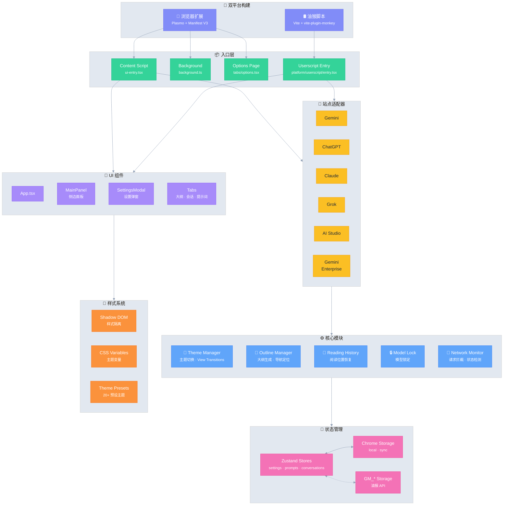

# Ophel 🚀

<p align="center">
  
</p>

<p align="center">
  <strong>✨ AI 之益，触手可及 ✨</strong><br/>
  <em>AI's Benefit, Within Reach.</em>
</p>

<p align="center">
  <a href="./LICENSE"></a>
  
  
  <a href="https://github.com/urzeye/ophel/actions/workflows/ci.yml"></a>
  <br/>
  <a href="https://github.com/urzeye/ophel/stargazers"></a>
  <a href="https://github.com/urzeye/ophel/network/members"></a>
  <a href="https://github.com/urzeye/ophel/issues"></a>
  <br/>
  <a href="https://chromewebstore.google.com/detail/ophel-ai-%E5%AF%B9%E8%AF%9D%E5%A2%9E%E5%BC%BA%E5%B7%A5%E5%85%B7/lpcohdfbomkgepfladogodgeoppclakd"></a>
  <a href="https://addons.mozilla.org/zh-CN/firefox/addon/ophel-ai-chat-enhancer/"></a>
  <a href="https://greasyfork.org/zh-CN/scripts/563646-ophel-ai-chat-page-enhancer"></a>
</p>

<!-- Promo Link -->
<p align="center">
  <strong>📢 <a href="https://github.com/urzeye/ophel/issues/30">Help promote Ophel / 帮忙宣传 Ophel</a></strong>
</p>

<p align="center">
  <a href="https://www.producthunt.com/products/ophel?embed=true&utm_source=badge-featured&utm_medium=badge&utm_campaign=badge-ophel" target="_blank" rel="noopener noreferrer"></a>
</p>

<p align="center">
  <a href="#-功能演示">功能演示</a> •
  <a href="#-核心功能">核心功能</a> •
  <a href="#%EF%B8%8F-技术架构">技术架构</a> •
  <a href="#-快速开始">快速开始</a> •
  <a href="#-支持项目">支持项目</a>
</p>

<p align="center">
  🌐 <a href="./README_EN.md">English</a> | <strong>简体中文</strong> | <a href="./.github/i18n-readmes/README_zh-TW.md">繁體中文</a> | <a href="./.github/i18n-readmes/README_ja.md">日本語</a> | <a href="./.github/i18n-readmes/README_ko.md">한국어</a> | <a href="./.github/i18n-readmes/README_de.md">Deutsch</a> | <a href="./.github/i18n-readmes/README_fr.md">Français</a> | <a href="./.github/i18n-readmes/README_es.md">Español</a> | <a href="./.github/i18n-readmes/README_pt.md">Português</a> | <a href="./.github/i18n-readmes/README_ru.md">Русский</a>
</p>

---

👋 **Ophel** 是一款同时支持 **浏览器扩展** 和 **油猴脚本** 的 AI 聊天页面增强工具，为 **Gemini**、**ChatGPT**、**Claude**、**Grok**、**AI Studio** 等主流 AI 平台提供统一的交互体验。

## 📹 功能演示

|                                                        大纲 Outline                                                        |                                                     会话 Conversations                                                     |                                                       功能 Features                                                        |
| :------------------------------------------------------------------------------------------------------------------------: | :------------------------------------------------------------------------------------------------------------------------: | :------------------------------------------------------------------------------------------------------------------------: |
| <video src="https://github.com/user-attachments/assets/a40eb655-295e-4f9c-b432-9313c9242c9d" width="280" controls></video> | <video src="https://github.com/user-attachments/assets/a249baeb-2e82-4677-847c-2ff584c3f56b" width="280" controls></video> | <video src="https://github.com/user-attachments/assets/6dfca20d-2f88-4844-b3bb-c48321100ff4" width="280" controls></video> |

## ✨ 核心功能

- 🧠 **智能大纲** — 自动解析用户问题与 AI 回复，生成可导航的目录结构
- 💬 **会话管理** — 文件夹分类、标签、搜索、批量操作
- ⌨️ **提示词库** — 变量支持、Markdown 预览、分类管理、一键填充
- 🎨 **主题定制** — 20+ 深色/浅色主题，自定义 CSS
- 🔧 **界面优化** — 宽屏模式、页面与用户问题宽度调整、侧边栏布局控制
- 📖 **阅读体验** — 滚动锁定、阅读历史恢复、Markdown 渲染优化
- ⚡ **效率工具** — 快捷键、模型锁定、标签页自动命名、完成通知
- 🎭 **Claude 增强** — Session Key 管理、多账号切换
- 🔒 **隐私优先** — 本地存储、WebDAV 同步、无数据收集

## 🏗️ 技术架构

**技术栈**：[Plasmo](https://docs.plasmo.com/) + [React](https://react.dev/) + [TypeScript](https://www.typescriptlang.org/) + [Zustand](https://github.com/pmndrs/zustand)

<details>
<summary>📐 架构图（点击展开）</summary>



</details>

## 🚀 快速开始

> [!tip]
>
> **推荐使用浏览器扩展（Extension）版本**，功能更全、体验更佳、兼容性更好。油猴脚本（Userscript）版本功能受限（如无法读取 Cookie、无独立弹窗等）。

### 应用商店

[Chrome](https://chromewebstore.google.com/detail/ophel-ai-%E5%AF%B9%E8%AF%9D%E5%A2%9E%E5%BC%BA%E5%B7%A5%E5%85%B7/lpcohdfbomkgepfladogodgeoppclakd) | [Firefox](https://addons.mozilla.org/zh-CN/firefox/addon/ophel-ai-chat-enhancer) | [Greasy Fork](https://greasyfork.org/zh-CN/scripts/563646-ophel)

### 手动安装

#### 浏览器扩展

1. 从 [Releases](https://github.com/urzeye/ophel/releases) 下载并解压安装包
2. 打开浏览器扩展管理页面，开启 **开发者模式**
3. 点击 **加载已解压的扩展程序**，选择解压的文件夹

#### 油猴脚本

1. 安装 [Tampermonkey](https://www.tampermonkey.net/) 插件
2. 从 [Releases](https://github.com/urzeye/ophel/releases) 下载 `.user.js` 文件
3. 拖入浏览器或点击链接即可安装

### 本地构建

<details>
<summary>展开查看构建步骤</summary>

**环境要求**：Node.js >= 20.x, pnpm >= 9.x

```bash
git clone https://github.com/urzeye/ophel.git
cd ophel

pnpm install
pnpm dev              # 开发模式
pnpm build            # Chrome/Edge 生产构建
pnpm build:firefox    # Firefox 生产构建
pnpm build:userscript # 油猴脚本生产构建
```

</details>

### 🐛问题反馈

如有问题或建议，欢迎在 [GitHub Issues](https://github.com/urzeye/ophel/issues) 反馈。

## ⭐ Star History

<a href="https://star-history.com/#urzeye/ophel&Date">
 <picture>
   <source media="(prefers-color-scheme: dark)" srcset="https://api.star-history.com/svg?repos=urzeye/ophel&type=Date&theme=dark" />
   <source media="(prefers-color-scheme: light)" srcset="https://api.star-history.com/svg?repos=urzeye/ophel&type=Date" />
   
 </picture>
</a>

## 💖 支持项目

<p align="center">
  <em>"一个人可以走得很快，但一群人可以走得更远。"</em>
</p>

<p align="center">
  如果 Ophel 对你有帮助，欢迎支持：<br/><br/>
  <a href="https://opencollective.com/urzeye-oss">
    
  </a>
</p>

<p align="center">
  Made with ❤️ by <a href="https://github.com/urzeye">urzeye</a>
</p>

## 📜 许可证

本项目采用 **CC BY-NC-SA 4.0** 协议。详情请参阅 [LICENSE](./LICENSE)。

> ⚠️ **禁止商业打包、倒卖或未授权集成。** 商业授权请联系：**<igodu.love@gmail.com>**
